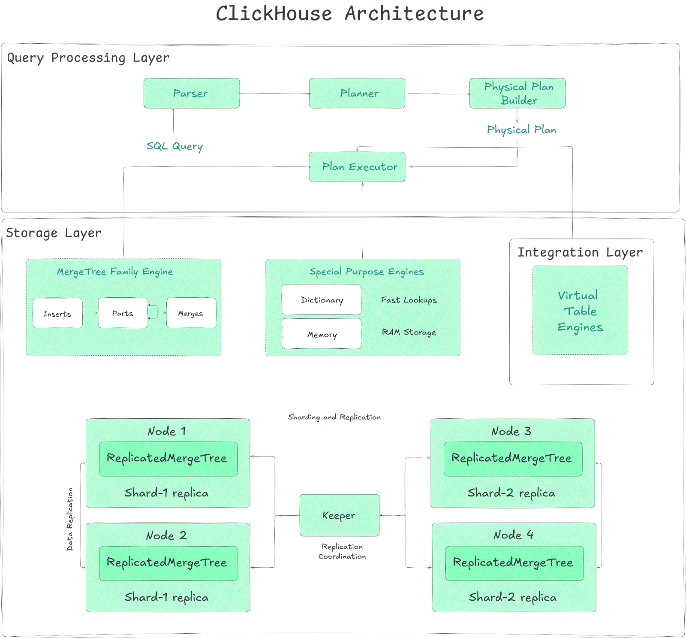

# Architecture

The ClickHouse architecture splits broadly into three layers:

- Query Processing Layer — The brain of the operation.
- Storage Layer — Where and how data resides.
- Integration Layer — Connecting to the outside world

Each layer within the ClickHouse Architecture plays a distinct role in the query lifecycle—from ingestion and storage to processing and integration with external systems.

## Query Processing Layer

ClickHouse’s query processing layer is where the magic happens within the ClickHouse Architecture. It’s the engine that takes your SQL queries, optimizes them, and executes them with blazing speed.

Query processing layer of the ClickHouse Architecture is designed to handle massive datasets and high ingestion rates. Let’s dive into how it works and what makes it so efficient.

First things first, how are queries processed in the ClickHouse Architecture? When you send a query to ClickHouse, it doesn't just jump straight to execution. Instead, it goes through a series of steps designed to optimize performance:

- Parsing — The SQL query text is parsed into an Abstract Syntax Tree (AST).

- Optimization (Logical & Physical) — The AST is transformed into a logical query plan, which is then optimized (filter pushdown, constant folding, predicate reordering). This logical plan is further converted into a physical execution plan, considering table engine specifics (utilizing sorted primary keys to avoid sorting steps).

- Execution Plan & Scheduling — An execution plan is created, which outlines the pipeline of operators. ClickHouse unfolds this plan into parallel execution lanes based on available cores and data distribution.

- Execution — Finally, the query is executed. ClickHouse uses the vectorized engine across multiple threads and potentially multiple nodes, leveraging SIMD instructions where possible.

### Core Components

#### Vectorized Execution Model

First off, ClickHouse doesn't usually handle data row-by-row, which is slow. Instead, it employs a vectorized execution model. This means operators (the building blocks of a query plan, like filters or aggregations) work on batches (vectors) of column values at a time. Processing data in chunks like this dramatically reduces overhead and improves CPU cache usage. You see similar ideas in systems like Snowflake or DuckDB.

To squeeze out even more speed, ClickHouse uses opportunistic code compilation. For computationally intensive parts of a query (complex expressions, aggregations, sorting), it can use LLVM to compile optimized, native machine code specifically for that task, right when it's needed. This compiled code is then cached and potentially reused by later queries.

#### Parallelization at Multiple Levels

Parallelism is deeply integrated into the ClickHouse Architecture:

- Data Elements (SIMD) — Down at the individual CPU core level, ClickHouse uses SIMD (Single Instruction, Multiple Data) instructions. Think of these as special CPU commands that can perform the same operation (like adding numbers or checking a condition) on multiple data points simultaneously within a single clock cycle. It can use compiler auto-vectorization or hand-tuned intrinsics and picks the best available on your CPU at runtime.

- Data Chunks (Multi-Core) — On a single server (node), ClickHouse processes different chunks of data across multiple CPU cores. It breaks the query plan into independent execution lanes. Each lane works on a different range of the data. Operators within these lanes process data chunks (those vectors we talked about). To keep things balanced, especially after filtering steps where one core might end up with more work than another, it uses exchange operators like Repartition to shuffle data between lanes dynamically. Operators themselves act like little state machines, requesting chunks, processing them, and making results available. The system tries to keep work for the same lane on the same core to help CPU caches stay "hot".

- Table Shards (Multi-Node) — If your table is massive and you've sharded it across multiple ClickHouse servers in a cluster, the query processing layer orchestrates work across these nodes. The node that receives your query (the initiator) optimizes the plan to push as much work as possible (like scanning, filtering, and maybe even partial aggregation) out to the nodes holding the data shards. These worker nodes process their local shard data and send back intermediate results (or sometimes raw data, depending on the query) to the initiator node, which then performs the final merge.

Advanced Optimizations in Query Processing Within the Clickhouse Architecture
ClickHouse uses several optimizations to make query processing faster:

- Query Optimization — Optimizations occur at multiple stages:

  - AST Level — Techniques like constant folding (e.g: turning 1+2 into 3) are applied early.
  - Logical Plan Level — Filter pushdown moves filtering conditions closer to the data source, reducing data volume early. Common subexpressions are eliminated. Disjunctions might be converted to IN lists.
  - Physical Plan Level — The planner leverages table engine specifics. For MergeTree tables, if the query's ORDER BY clause matches a prefix of the table's primary key, sorting steps can be entirely removed from the plan. Similarly, if grouping keys match the primary key prefix, a more memory-efficient sort aggregation can be used instead of hash aggregation.

- Query Compilation — For frequently executed computation patterns within queries (like complex expressions, aggregation functions, or multi-key sorts), ClickHouse uses LLVM to compile optimized machine code at runtime. This fuses multiple operations, reduces virtual function calls, improves register/cache usage, and leverages the fastest available CPU instructions. Compiled code is cached for reuse.

- Data Pruning and Skipping — To avoid reading unnecessary data:

  - Primary Key Index — ClickHouse uses the sparse primary key index to quickly identify granules (blocks of 8192 rows) that might contain relevant data for WHERE clauses matching the key prefix. It uses efficient range scanning and ternary logic during index analysis. It can also optimize functions on key columns by analyzing function monotonicity or calculating preimages.
  - Skipping Indices — Lightweight data structures (min-max, set, bloom filters) built over granules allow skipping data based on conditions on non-primary-key columns.
  - Statistics-Based Filtering — Filters are evaluated sequentially, often ordered by estimated selectivity (based on heuristics or collected column statistics) to discard the maximum number of rows with the cheapest predicates first.

- Hash Table Optimizations — Hash tables are fundamental for GROUP BY aggregations and hash joins. ClickHouse selects from over 30 specialized hash table implementations based on key data types (numeric, string, fixed-size, tuples), estimated cardinality, and other factors. Optimizations include:

  - Two-level layouts for huge key sets.
  - Specialized string hash tables.
  - Direct lookup tables (no hashing) for very small cardinalities.
  - Embedded hashes for faster collision checks with complex types.
  - Pre-sizing based on runtime statistics.
  - Efficient memory allocation (slab allocators).
  - Fast clearing using version counters.
  - CPU prefetching (\_\_builtin_prefetch) during lookups.

- Join Execution — ClickHouse supports standard SQL join types (INNER, LEFT/RIGHT/FULL OUTER, CROSS, AS OF) and multiple algorithms:

  - Hash Join — The most common type, featuring a highly optimized parallel implementation where both build and probe phases are parallelized across multiple threads using partitioned hash tables to minimize synchronization.
  - Sort-Merge Join — Used when inputs are sorted on join keys.
  - Index Join — Applicable for joins against tables with fast key-value lookup capabilities (like Dictionary tables).

Handling Simultaneous Queries in the ClickHouse Architecture
ClickHouse is designed to handle multiple queries simultaneously without performance degradation. It does this by:

- Concurrency Control — ClickHouse dynamically adjusts the number of threads a query can use based on overall system load and configured limits.

- Memory Usage Limits — ClickHouse tracks memory allocations at the server, user, and query levels. If a query tries to use too much memory for (say) aggregation or sorting, it can gracefully spill data to disk and use external algorithms instead of just crashing.

- I/O Scheduling — ClickHouse allows you to restrict local and remote disk accesses for workload classes based on maximum bandwidth, in-flight requests, and policy.

### Data Storage Layer

ClickHouse's storage layer is the unsung hero behind its blazing-fast performance and a critical part of the ClickHouse Architecture. It's designed to handle massive datasets with high ingestion rates, all while keeping queries snappy. Let's dive into the details of how this layer of the ClickHouse Architecture stores and manages data, focusing on the MergeTree family of table engines, which are the workhorses of this system.

The ClickHouse Storage Layer, a fundamental piece of the ClickHouse Architecture, is built around the concept of Table Engines. You choose a table engine when you create a table, and that engine determines:

- How and where data is physically stored.
- Which queries are supported and how they perform.
- Whether data is replicated.
- How data indexing works.

These engines fall into roughly three families within the ClickHouse Architecture:

1. The MergeTree* Family Engine
   The MergeTree* family is the main engine family within Clickhouse Architecture and what it's famous for. If you're storing serious amounts of data for analytics, you're likely using one of these. The design of the MergeTree engine is central to the performance characteristics of the ClickHouse Architecture.

The MergeTree Family Engine is inspired by Log-Structured Merge Trees (LSM Trees), but don't mistake it for a direct copy. Data you insert gets written as immutable "parts"—essentially, batches of rows sorted according to the table's primary key. In the background, ClickHouse continuously merges these smaller parts into larger ones. This keeps the number of parts manageable and optimizes data for reads.

How Data Sits on Disk:

- Columnar — Data for each column is stored in separate files within a part's directory. This is great for analytical queries that often only need a few columns.

- Granules — Within a column file, data is logically chunked into "granules." A granule is the smallest indivisible unit ClickHouse processes during scans (typically 8192 rows).

- Blocks — For actual disk I/O, ClickHouse reads and writes compressed "blocks" (defaulting around 1 MB). A block might contain several granules depending on the data type and compression.

- Compression — Blocks are compressed (LZ4 is the default, but you can choose others like ZSTD, or even chain codecs, maybe delta coding followed by LZ4). This saves space and often speeds up queries because less data needs to travel from disk.

- Sparse Primary Key Index — This is key! For each part, ClickHouse keeps a small index file in memory. This index doesn't point to every row, but rather to the primary key values at the start of every granule. Since the data within a part is sorted by this primary key, ClickHouse can use this sparse index to quickly figure out which granules might contain the data you need, skipping over huge chunks of irrelevant data.

Getting Data In — Inserts

You can insert data synchronously, where each INSERT potentially creates a new small part (which is why batching inserts is recommended). Or, you can use asynchronous inserts. ClickHouse buffers incoming rows and writes a new part only when the buffer hits a certain size or timeout, which is a whole lot better for scenarios with lots of small, frequent inserts, as it reduces merge overhead.

Finding Data Faster (Pruning)
Besides the primary key index, ClickHouse uses other tricks to avoid reading unnecessary data:

- Projections — Projections are pre-computed, alternative versions of your table, sorted differently or containing only a subset of columns/rows, potentially aggregated. If a query filters or aggregates on columns that match a projection's definition, ClickHouse might use the smaller, faster projection instead of the main table. They are populated lazily by default when new data arrives.

- Skipping Indices — These are lightweight metadata structures stored for blocks of granules (not every granule). You can define them in arbitrary expressions. Types include:

  - minmax — Stores min/max values for the expression in that block. Great for range queries on somewhat sorted data.

  - set — Stores unique values (up to a limit). Good for IN or = queries on columns with low cardinality locally ("clumped" values).
  - bloom_filter — Probabilistic check for existence. Useful for equality checks on high-cardinality columns or text search, with a small chance of false positives (reading data you don't need) but no false negatives.

Transforming Data During Merges
The background merge process isn't just about combining parts; it can also transform data:

- ReplacingMergeTree — Keeps only the latest version of rows with the same primary key, effectively handling updates or deduplication during merges.

- AggregatingMergeTree — Collapses rows with the same primary key by combining aggregate function states (like intermediate results for sum(), avg(), uniq()). This is often used with Materialized Views to pre-aggregate data incrementally.

- TTL (Time-To-Live) Merges — Automatically delete or move old data (e.g: to slower storage like S3) based on time expressions during merges. You can also trigger recompression or aggregation based on age.

Handling Updates and Deletes
OLAP (Online Analytical Processing) systems aren't typically designed for frequent updates/deletes, but sometimes you need them:

- Mutations (ALTER TABLE ... UPDATE/DELETE) — These rewrite the affected parts entirely. They are heavyweight operations, especially deletes, as they rewrite all columns in the affected parts. They are also non-atomic, meaning concurrent reads might see data before or after the mutation during the process.

- Lightweight Deletes (DELETE ... WHERE) — A faster alternative. This just updates an internal bitmap column to mark rows as deleted. SELECT queries automatically filter these out. The rows are physically removed later during normal background merges. It's faster to execute the ALTER but can make subsequent SELECT queries slightly slower.

Keeping Data Safe and Scaled (Replication)
You typically use ReplicatedMergeTree variants (ReplicatedAggregatingMergeTree). Replication works on a multi-master model coordinated via ClickHouse Keeper (a C++ Raft consensus implementation, think Zookeeper but built-in). Each replica processes inserts and merges locally but coordinates through Keeper to ensure all replicas eventually converge to the same state by fetching missing parts or replaying operations logged in Keeper. It aims for eventual consistency.

ACID Properties

ClickHouse provides snapshot isolation for queries (you see data consistent as of the query start time, thanks to immutable parts). But note that, it's generally not fully ACID compliant like transactional databases. For performance, it doesn't typically fsync every write by default, meaning a power loss could potentially lose very recent data that wasn't flushed by the OS.

2. Special-Purpose Table Engines
   Special-Purpose table engines serve specific niches, often complementing MergeTree tables:

- Dictionary — Technically related to the Integration Layer but defined like a table. These are typically in-memory key-value structures loaded from various sources (including other ClickHouse tables, files, or external databases). They provide very fast lookups, great for enriching fact tables with dimension attributes during queries (like joins).

- Memory — A simple engine that holds data purely in RAM. Useful for temporary tables, but data is lost on restart.

(Others exist for specific tasks like logging (Log engine family), buffering (Buffer engine), etc.)

3. Virtual Table Engines
   Virtual Table Engines don't store data themselves but act as connectors to external systems. They blur the line between the Storage and Integration layers because you define them like tables, but they interact with outside data. Examples include engines (Table Functions or specific engines) to query:

Relational databases (MySQL, PostgreSQL) - (MySQL engine, PostgreSQL engine)
Object storage (S3, GCS, Azure Blob Storage) - (S3 engine)
Message queues (Kafka) - (Kafka engine)
Data Lake table formats (Hudi, Iceberg, Delta Lake) - (DeltaLake engine, Hudi engine, Iceberg engine)
Files (CSV, Parquet, JSON, etc.) - (File engine)
Sharding and Replication Layer (Built on Table Engines)
While not a separate engine type, how ClickHouse distributes data heavily relies on the Storage Layer concepts:

- Sharding — You can split a large logical table across multiple ClickHouse nodes (shards). Each shard holds a portion of the data, usually in a local ReplicatedMergeTree table. Queries are then processed in parallel across shards using the Distributed table engine, which acts as a proxy, forwarding queries to shards and aggregating results. This lets you scale beyond a single server's capacity.

- Replication — As mentioned under MergeTree, using Replicated engines guarantees that each shard's data is copied across multiple nodes for fault tolerance. ClickHouse Keeper manages this coordination.

So, the ClickHouse Storage Layer is quite sophisticated. Its use of different table engines, particularly the highly optimized MergeTree family with its specific on-disk format, sparse indexing, and merge strategies, is fundamental to how ClickHouse achieves its high performance for analytical workloads and massive data volumes. You essentially choose the right tool (engine) for the job when you define your tables.

### Connectivity and Integration Layer

ClickHouse isn’t just a high-performance OLAP (Online Analytical Processing) database; it’s a system designed to integrate seamlessly with your existing data ecosystem. The integration layer in ClickHouse architecture offers flexibility and compatibility that sets it apart in the analytics space.

The integration layer in ClickHouse serves as the bridge between the database and external systems, which enables seamless data exchange and compatibility with diverse data ecosystems.

#### How ClickHouse Handles Data Integration

ClickHouse adopts a pull-based approach for integrating external data. Instead of having to rely on external components to push data into the system, ClickHouse connects directly to remote data sources and retrieves the necessary data.

#### External Connectivity in ClickHouse Architecture

ClickHouse supports over 50 integration table functions and engines, allowing it to connect with a wide range of external systems. These include:

Relational databases (MySQL, PostgreSQL, SQLite) - via engines like MySQL, PostgreSQL, or ODBC / JDBC table functions.
Object storage (AWS S3, Google Cloud Storage (GCS), Azure Blob Storage) - often via the S3 table engine or S3 table function.
Streaming systems (Kafka) - via the Kafka engine.
NoSQL/Other systems (Hive, MongoDB, Redis) - via engines/functions like Hive, MongoDB, Redis.

Data Lakes (interacting with formats like Iceberg, Hudi, Delta Lake ) - via engines like Iceberg, Hudi, DeltaLake.
Standard protocols like ODBC - via the ODBC table function.

#### Data Formats Supported by ClickHouse Architecture

ClickHouse doesn't just connect to systems; it understands formats. Beyond its own native format, it can read and write a ton of others. This includes essentials like:

    * CSV
    * JSON
    * Parquet
    * Avro
    * ORC
    * Arrow
    * Protobuf
    * etc.

#### Compatibility Interfaces in ClickHouse Architecture

To enhance interoperability with existing tools and applications, ClickHouse provides MySQL- and PostgreSQL-compatible wire-protocol interfaces. These interfaces allow applications that already support MySQL or PostgreSQL to interact with ClickHouse without requiring native connectors.

In short, the Integration Layer in ClickHouse architecture is what makes ClickHouse a perfect choice. It provides the functions, engines, format support, and compatibility interfaces needed to pull data from, push data to, and interact with a wide variety of external systems directly from within the database.
