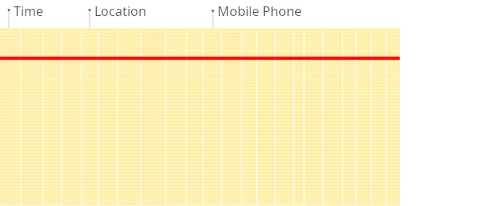
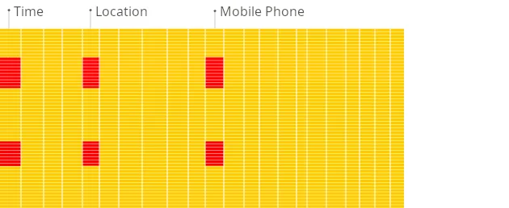

1. [What Is ClickHouse?](#what-is-clickhouse)
   - [Open Source](#open-source)
   - [Column-Oriented (or Columnar)](#column-oriented-or-columnar)
   - [DBMS (Database Management System)](#dbms-database-management-system)
   - [Optimized for OLAP (Online Analytical Processing)](#optimized-for-olap-online-analytical-processing)
   - [Real-Time Analytics](#real-time-analytics)
   - [Distributed](#distributed)

---

# What Is ClickHouse?

Alright, let's get to the core definition. ClickHouse is an open source distributed, columnar database management system (DBMS) built for speed on analytical OLAP (Online Analytical Processing) queries. It lets you analyze petabytes of data quickly by storing and processing data in columns, a fundamental aspect of the ClickHouse Architecture. The system runs SQL queries on raw data directly while taking advantage of modern hardware, which means you get results in real-time even when working with huge volumes of data.

## Open Source

ClickHouse is fully open source (under the Apache 2.0 license).

## Column-Oriented (or Columnar)

This is fundamental to the ClickHouse Architecture. Unlike traditional row-oriented databases (MySQL, PostgreSQL) that store all values for a row together, ClickHouse stores all values belonging to a single column together.

Why it matters for OLAP (Online Analytical Processing): Analytical queries often aggregate or filter data based on a few columns out of potentially hundreds. ClickHouse only needs to read the data files for those specific columns, drastically reducing disk I/O compared to reading entire rows.

Traditional Row-Oriented Database:

<small>_Traditional Row-Oriented Database (Source: [ClickHouse](https://clickhouse.com/docs/faq/general/columnar-database)) - ClickHouse Architecture_</small>

ClickHouse Columnar Database:

<small>_Columnar Database (Source: [ClickHouse](https://clickhouse.com/docs/faq/general/columnar-database)) - ClickHouse Architecture_</small>

## DBMS (Database Management System)

ClickHouse is a full-fledged system for creating and managing databases, tables, users, permissions, and executing queries. It's not just a storage library.

## Optimized for OLAP (Online Analytical Processing)

The ClickHouse Architecture is designed to execute complex analytical queries (aggregations like SUM, AVG, COUNT, GROUP BY, window functions) across massive datasets (billions or trillions of rows) and return results with low latency (often sub-second to seconds).

## Real-Time Analytics

The ClickHouse Architecture is engineered to ingest high volumes of data rapidly and make it available for querying almost immediately.

## Distributed

The ClickHouse Architecture is natively designed to scale horizontally across multiple servers (nodes) in a cluster for both storage capacity and query processing power.

ClickHouse is NOT designed for OLTP (Online Transaction Processing). It's generally inefficient for frequent, single-row inserts, updates, or deletes, or queries requiring strict transactional consistency across multiple operations.
What Are the Core Principles of ClickHouse (Why Is It So Fast)?
ClickHouse's speed stems from a combination of deliberate choices within the ClickHouse Architecture and low-level optimizations:

- Column‑Oriented Storage
  As mentioned above, this core element of the ClickHouse Architecture means less data read from disk for typical analytical queries. It also allows for much better data compression because data within a column is often similar.

- Data Compression
  ClickHouse Architecture leverages highly effective general-purpose codecs (like LZ4 - the default, ZSTD) and specialized codecs tailored for specific data types (like Gorilla for floats, Delta coding for timestamps/monotonic sequences, T64 for 64-bit integers). Compression can even be chained (Delta + LZ4). This saves storage space and reduces the amount of data transferred from disk/network, often speeding up queries.

- Vectorized Query Execution
  Instead of processing data row-by-row, one value at a time, ClickHouse processes data in chunks or "vectors" (batches of column values). Because of this, function call overhead is minimized and modern CPU capabilities (like SIMD aka Single Instruction, Multiple Data instructions) are better utilized, significantly speeding up calculations.

- Distributed Query Processing (Parallel Processing)
  In ClickHouse, queries are automatically parallelized across multiple CPU cores and even multiple servers in a cluster. It tries to use all available hardware resources to get your answer faster.

- Sparse Primary Index & Data Skipping
  ClickHouse uses a sparse primary index associated with its MergeTree tables. It doesn't index every row. Instead, it stores index "marks" for every Nth row (a "granule," typically 8192 rows). Since data within a storage part is sorted by the primary key, this sparse index allows ClickHouse to quickly identify and load only the relevant granules from disk for queries filtering on the primary key, skipping large irrelevant blocks. Skipping indices (like min-max, set, bloom filters) provide similar capabilities for non-primary key columns.

- Hardware Optimization
  ClickHouse is written in C++ and designed to utilize CPU resources (cache, SIMD), memory bandwidth, and I/O efficiently. It avoids JVM overhead and aims for bare-metal performance.

- SQL with Extensions
  ClickHouse provides a familiar SQL interface but extends it with powerful features for analytics, including rich support for arrays, nested data structures, approximate query processing functions, window functions, and integration capabilities.

- Scalability (Vertical & Horizontal)
  ClickHouse scales vertically by utilizing more resources on a single node and horizontally by distributing data and queries across multiple nodes (sharding).

- Fault Tolerance & Replication
  ClickHouse supports asynchronous multi-master replication for its ReplicatedMergeTree tables, typically coordinated by ClickHouse Keeper (a C++ implementation of the Raft consensus algorithm). This allows multiple copies (replicas) of data shards for high availability and read scaling.

# What is ClickHouse used for?

First up, let's look at what are the key features enabled by the ClickHouse Architecture.

The Features of ClickHouse

## Columnar Storage

As we have already covered above, ClickHouse stores data by column, instead of storing data row by row like traditional databases. Why does this matter? When you run analytical queries (like calculating an average or sum over a specific column), the system only needs to read the data for that column, not slice through unrelated data in rows. Due to this, I/O is drastically reduced and things are sped up.

## Vectorized Query Execution

ClickHouse processes data in batches, or "vectors," rather than single values at a time. Due to this, it leverages CPU cache better and uses SIMD (Single Instruction, Multiple Data) CPU instructions more effectively. Basically, it tells the CPU to perform the same operation on multiple data points simultaneously.

## Data Compression

ClickHouse uses excellent data compression. Since data in columns tends to be similar (like lots of the same URLs or event types), it compresses really well. Due to this, it saves storage space and often speeds up queries, as less data needs to travel from disk to memory.

## SQL Support with Extended Syntax

You can easily interact with ClickHouse using SQL, which is familiar territory for many. Its dialect is powerful and includes extensions for array handling and analytical functions. It's not exactly standard SQL everywhere, so you might need to adjust some habits, but it's close and quite capable.

## Distributed Processing Power

ClickHouse is built to scale horizontally. It supports sharding and replication, allowing you to distribute your data across multiple nodes. When you run a query, each node processes its partition of the data in parallel, and the results are merged seamlessly. This offers both high throughput and fault tolerance.

## Real-Time Data Ingestion & Low-Latency Analytics (Real-Time Analytics)

ClickHouse is optimized for continuously inserting high-volume data. It processes incoming data in batches and uses asynchronous background merges, which gives you near real-time query responses even with billions of rows.

## Materialized Views

These aren't your typical SQL views. ClickHouse materialized views can store pre-aggregated data. As new data flows into a source table, the materialized view automatically aggregates it. Queries hitting the view are then super fast because the hard work is already done incrementally.

## Fault Tolerance & Replication

ClickHouse uses an asynchronous multi-master replication approach coordinated by ZooKeeper to make sure that your data is available even if one or more nodes fail. Due to this, you can write to any node and have the data distributed across replicas automatically. (Note: Modern ClickHouse often uses ClickHouse Keeper instead of ZooKeeper)

## Pluggable Storage Engines

While the default MergeTree family of engines is usually the star for OLAP (Online Analytical Processing) tasks, ClickHouse supports other engines for different needs, like integrating with Kafka or handling smaller lookup tables.

And many more…

# Common Use Cases of ClickHouse

Clickhouse's speed with analytical queries and its ability to handle huge amounts of data in real-time, characteristics derived from the ClickHouse Architecture, make it well-suited for a few key areas.

## Real-Time Analytics

ClickHouse excels in scenarios where you need immediate insights from massive data streams. You can use it to build dashboards for monitoring website traffic, user behavior, or network metrics with sub-second query response times.

## Business Intelligence (BI)

ClickHouse can directly power Business Intelligence dashboards and ad-hoc analytical queries.

## Log Analysis & Management

Centralizing and analyzing application logs, server logs, or security logs becomes much easier when you can ingest them quickly and run complex search and aggregation queries without waiting forever.

## Security Information and Event Management (SIEM)

Similar to log analysis, SIEM systems need to process and correlate vast amounts of security-related events in near real-time to detect threats. The ingestion speed and analytical query performance fit well here.

## AdTech & Marketing Analytics

Analyzing impressions, clicks, conversions, and user journeys generates enormous datasets. ClickHouse helps analyze ad performance, calculate A/B test results quickly, and understand market dynamics in near real-time.

## Time-Series Data Analysis

Applications that involve sensor data, financial market streams, or IoT telemetry can benefit from ClickHouse. Its design is optimized for handling large numbers of time-stamped records, letting you analyze trends and patterns over time efficiently.

## Financial Data Analysis

Processing market data, tick data, or transaction logs where performance on time-series aggregations is key.

## Product Analytics

If you need to track how users interact with your product, ClickHouse offers the performance needed to store and analyze detailed clickstream or event data.

## Machine Learning & Data Preprocessing

While not its primary function, ClickHouse can be used as a data store for ML workloads. Its speed is useful for feature stores, preprocessing data, running vector searches, or powering analytics needed for model training, especially at petabyte scale. Some use it for observability in LLM applications.

And many more…

## Why Not Use It For Everything?

It's good to remember ClickHouse is specialized. It's an analytical database (OLAP), not a transactional one (OLTP (Online Transaction Processing)) like PostgreSQL or MySQL.

- It's generally not great for frequent updates or deletes of single rows. Its storage format is optimized for bulk reads and writes.
- It doesn't typically enforce ACID (Atomicity, Consistency, Isolation, Durability) guarantees the way traditional relational databases do for transactions.
- Its sparse index is not optimized for fetching single rows by key quickly. Use cases requiring many fast point lookups are better served by other databases.
- Joins can be more limited or less performant than in row-based databases, although this has improved over time.

Often, ClickHouse is used alongside a traditional OLTP (Online Transaction Processing) database. Transactional data is captured in the RDBMS, then streamed or batch-loaded into ClickHouse for analytical processing.
